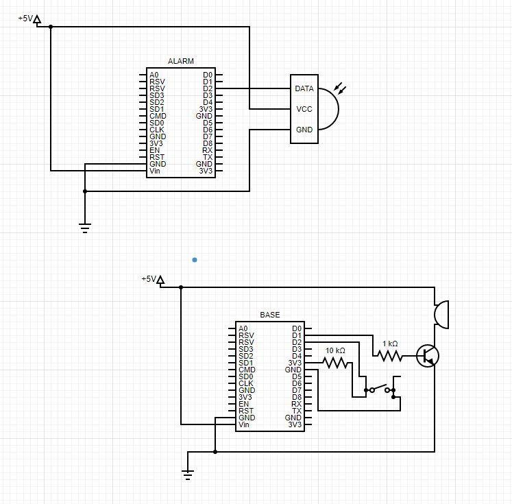

# Simple Alarm w/ esp8266
Simple alarm device + base project. One ESP acts as remote alarm device connected to a PIR motion sensor, the other acts as the central base and activate a buzzer when the alarm device reports a movement detection or stops sending periodic reports.
## Schematics

